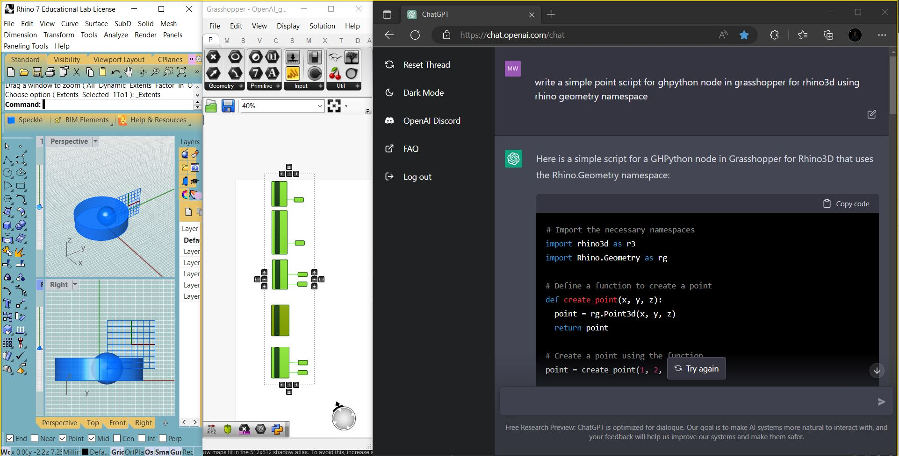

# Michael Wickerson

CEO and Co-founder at Wickerson Studios and former Chair of Sculpture at Kansas City Art Institute
foundry man,
parametric modeler,
art facilitator
Wickerson Studios is looking for Visiting, Material, and Creative Sponsors to support a range of emerging and mid-career artists out at Wickerson Studios in Kansas City, Kansas.

# About

Associate Professor and former Chair of Sculpture at the Kansas City Art Institute. A graduate from the University of Waterloo and York University in Canada, he has exhibited internationally in North America and Europe, collaborating with architects, engineers, programmers, and designers.

Recognized as an accomplished Python developer, Wickerson's creative research incorporates mathematics, computer science, computational and parametric design, digital modeling, and programming as they relate to data visualization, machine learning, and robotics.

Metal Casting Foundry, Rhino 3D Digital Modeling, Grasshopper Node Programming, Python Script Development, Creative Coding for Augmented Reality, Interests in Creative Robotics and Machine Learning

